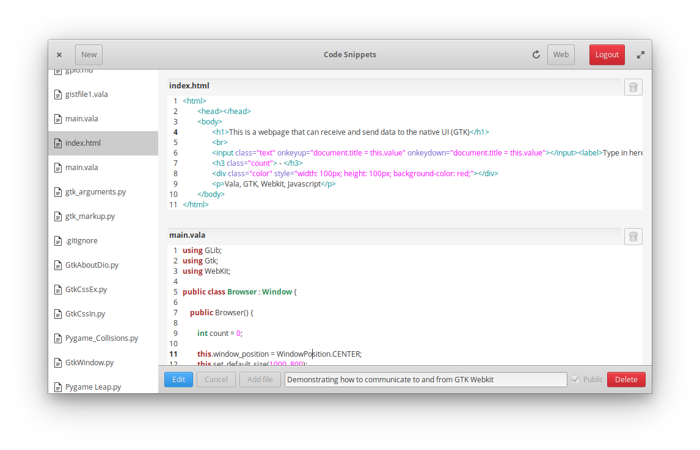

# Code Snippets (codename: gtk-gist-manager)
[](https://travis-ci.org/rickybas/gtk-gist-manager)

Create, view and edit code snippets fetched from Github Gists.



## Dependencies
These dependencies must be present before building

- `valac>= 0.22`
- `meson>=0.40.1`
- `valagist-1.0` ([found here](https://github.com/rickybas/vala-gist))
- `gtk+-3.0`
- `gtksourceview-3.0`
- `libsecret-1`

## Installation

```sh
git clone https://github.com/rickybas/gtk-gist-manager.git
meson build
cd build
ninja # or 'ninja-build' on some distributions
sudo ninja install
```

## Flatpak
(currently without a repo)

### Build

```sh
meson build
flatpak-builder build-dir com.github.rickybas.gtk-gist-manager.json
```

### Run

```sh
flatpak-builder --run build-dir com.github.rickybas.gtk-gist-manager.json com.github.rickybas.gtk-gist-manager
```

